软件工程复习资料
======
##第一章 软件工程概述
-------
1. 问题求解
	* 通过**分析**，将大问题拆解成小问题，通过**合成**将小问题合并
	* 工具 用更好的方式完成某件事情的设备或自动化系统
	* 过程 把工具和技术结合，共同生产特定产品
	* 范型 构造软件的特定方法或哲学
2. 软件工程师 把计算机作为问题求解的工具，而不是研究计算机理论
3. 错误(error) 是人为的，错误导致故障 (fault) ， 实效（failure）是指系统违背了它应有的行为
4. 三种考虑软件重量得到方式：
	* 产品的质量
	* 过程的质量
	* 商业环境背景下的质量
5. 涉及人员：
	* 客户  为开发软件支付费用
	* 用户  实际使用系统的人
	* 开发人员  为客户构建软件系统
6. 系统定义：
 
	>一组实体、一组活动、实体活动之间关系的描述、系统边界的定义。背景是项目的边界

7. 系统要素：
	1. 活动activity 对象object 实体entity 
		* 活动： 发生在系统中的某些事情，由某个触发器引发的事件
		* 对象、 实体： 活动中涉及的要素
	2. 关系和系统的边界
		实体的起源、实体的目的
8. 系统的边界很重要，一个系统可能存在另一个系统内部，也可能包含。
9. 两个系统差别越大，设计和开发就越困难
10. 增量开发包含一系列阶段，每隔阶段都使前面的系统不受当前系统约束的限制
11. 软件开发过程：
	* 需求分析和定义
	* 系统设计
	* 程序设计
	* 编程实现
	* 单元测试
	* 集成测试
	* 系统测试
	* 系统交付
	* 维护
12. 开发人员：
	1. 需求分析员 更好地理解客户的需求 分解为离散的需求
	2. 设计人员 与设计人员生成系统层描述 与程序员以代码行描述系统
	3. 程序员
	4. 测试人员
	5. 培训人员 向用户说明如何使用系统
	6. 维护人员
	7. 资料员
	8. 配置管理小组
13. 系统设计两种基本方式：
	1. 转换  将输入转换为输出
	2. 事务  由输入决定哪个功能将被执行
14. Wasserman 8个基本概念：
	* 抽象
	* 分析和设计方法以及表示法
	* 用户界面原型化
	* 软件体系结构
	* 软件过程
	* 复用
	* 测度
	* 工具和集成环境

##第二章 过程和生命周期的建模
=========
1. 过程：
> 一组有序的任务：涉及活动、约束和资源使用的一系列步骤，用于产生某种想要的输出。
2. 生命周期：```设计产品构建的过程```
3. 软件过程模型：
	* 瀑布模型 没有把软件看作一个问题求解的过程
	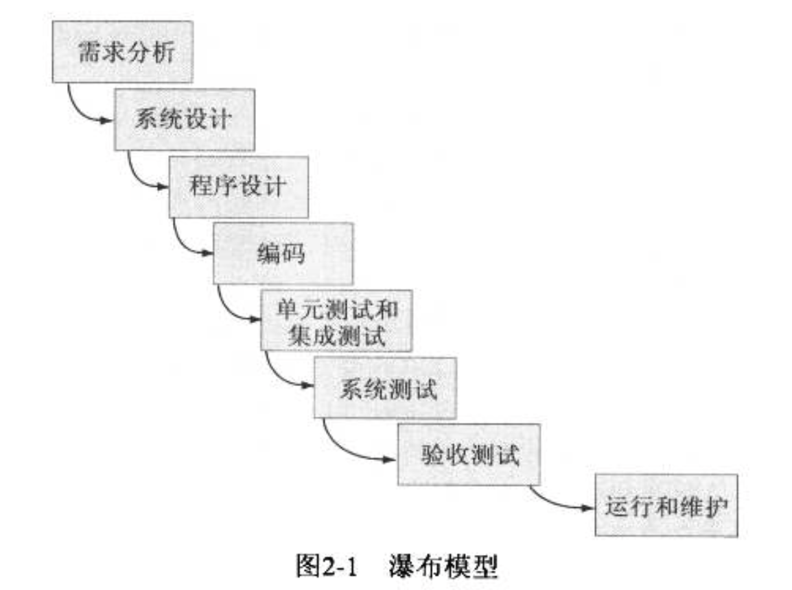
	* 原型化的瀑布模型  
	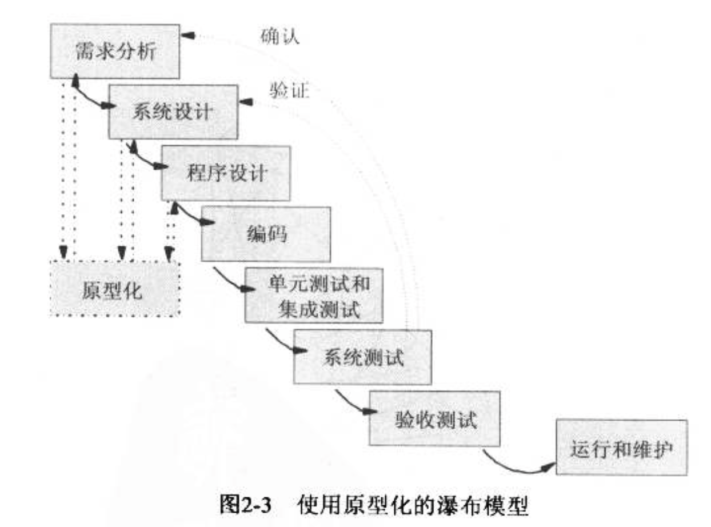
	* V模型  
	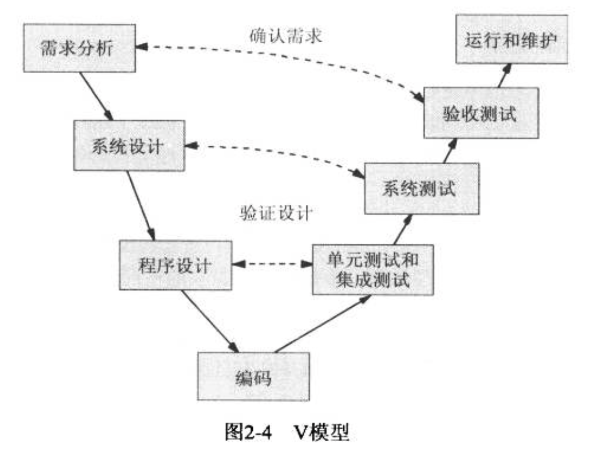
	* 原型化模型  
	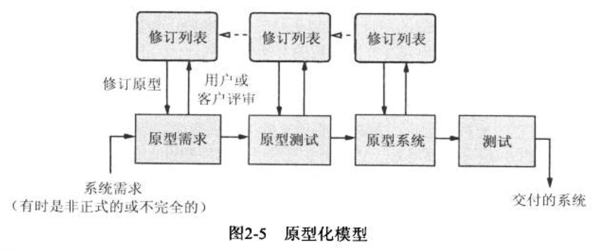
	* 可操作规格说明  
	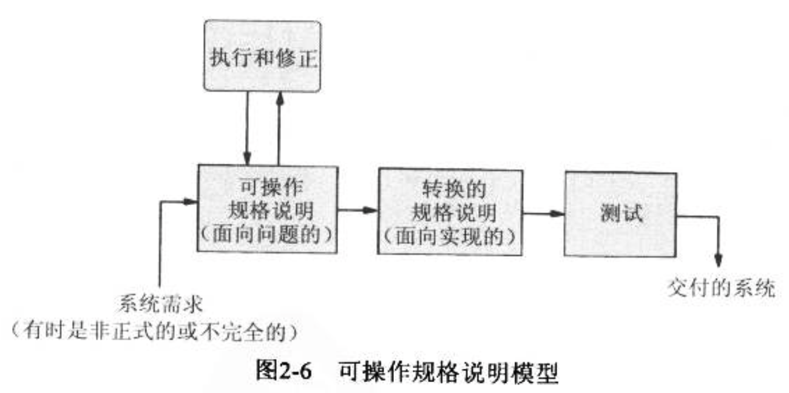
	* 可转换模型  
	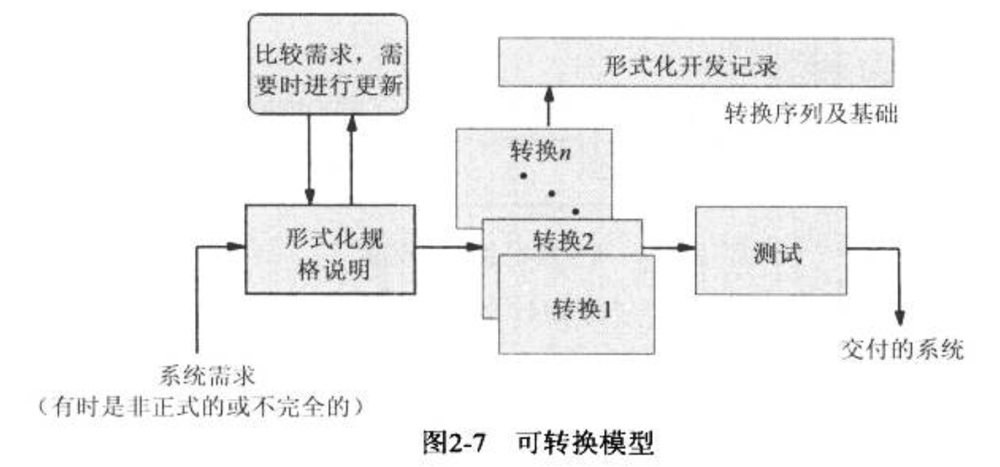
	* 阶段化开发模型
	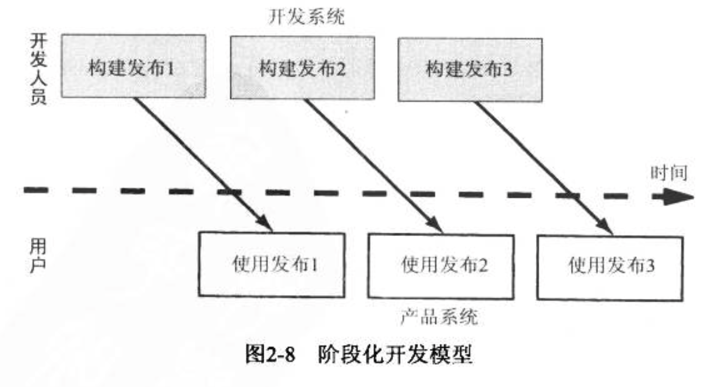
	* 增量模型和迭代模型
	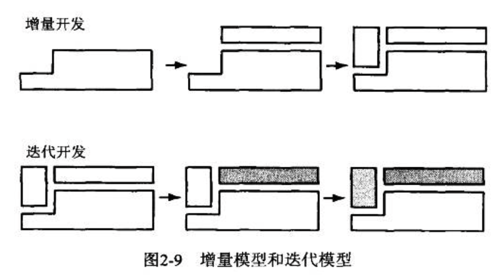
	* 螺旋模型  
	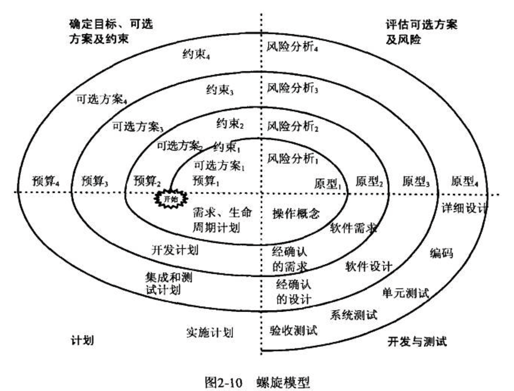

4. 敏捷宣言 
	* 个体和互动：高于 流程和工具。
	* 工作的软件：高于 详尽的文档。
	* 客户合作：高于 合同谈判。
	* 响应变化：高于 遵循计划。
5. 敏捷方法
	* 软件开发之韵，Software Development Rhythms
	* 敏捷数据库技术，AD/Agile Database Techniques
	* 敏捷建模，AM/Agile Modeling
	* 自适应软件开发，ASD/Adaptive Software Development ``` ？？```
	* 水晶方法，Crystal ```每个不同的项目都需要不同的策略、约定、方法论```
	* 特性驱动开发，FDD/Feature Driven Development
	* 动态系统开发方法，DSDM/Dynamic Systems Development Method
	* 精益软件开发，Lean Software Development
	* AUP（Agile Unified Process）
	* Scrum ```迭代方法，按需求优先级别来实现产品，多个小组并行递增```
	* XBreed
	* 极限编程，XP Extreme Programming ```交流、简单性、勇气、反馈```
	* 探索性测试
	* ATDD
6. XP(不完全)
	* 重构
	* 结对编程
	* 简单设计
	* 代码标准
7. 确认（validation）确保系统实现所有需求  
验证 (verification) 确保每一项功能都是正确的
8. 静态建模：Lai表示法

## 第三章 计划和管理项目
======
1. 活动 ```项目的一部分，在一段时间内发生```  
	里程碑 ```活动的完成，某一特定时刻```
2. 描述活动的4个参数
	* 前驱
	* 工期
	* 截止日期
	* 终点
3. 活动图 节点是里程碑， 连接节点的线表示包含的活动， 虚线表示一种没有伴随活动的关系
4. 估算时间 ```虚线不会产生额外时间```  
	真实时间 ```估算完成活动的必须时间```  
	可用时间 ```完成活动可用的时间量```  
	时差 = 可用时间 － 真实时间  
	时差＝ 最晚开始时间－最早开始时间  
	关键路径 每个节点的时差都为0的路径 可能不唯一
5. 甘特图 项目管理软件包

## 第四章 获取需求
======
1. 需求 是对期望的行为的表达
2. 规格说明 决定软件系统完成哪些需求  
	设计阶段 制定如何实现指定行为的计划
3. 需求获取  
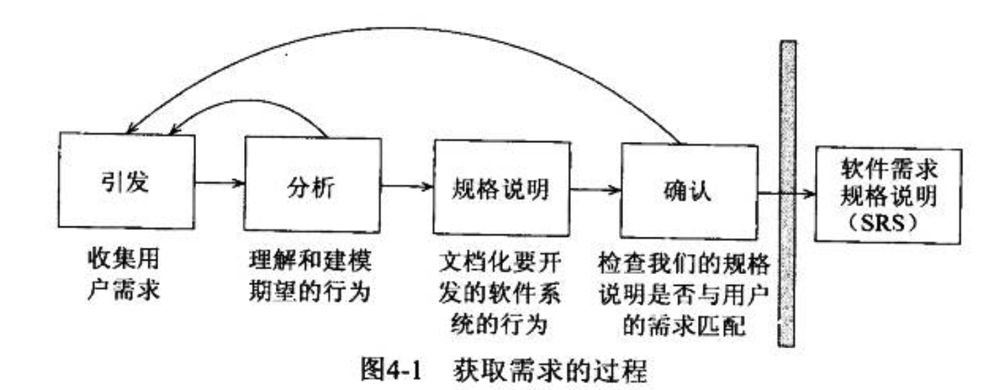
4. 需求的类型
	* 功能需求 根据要求的活动来描述需要的行为
	* 质量需求或非功能需求 描述软件解决方案必须拥有的质量特性，如 快速的响应时间、易用性、高可靠性、或低维护代价
	* 设计约束 已经做出的设计决策或限制问题解决方案集的设计决策 如平台或构件接口的选择
	* 过程约束 对于构建系统的技术和资源的限制。例如客户要求使用敏捷方法
	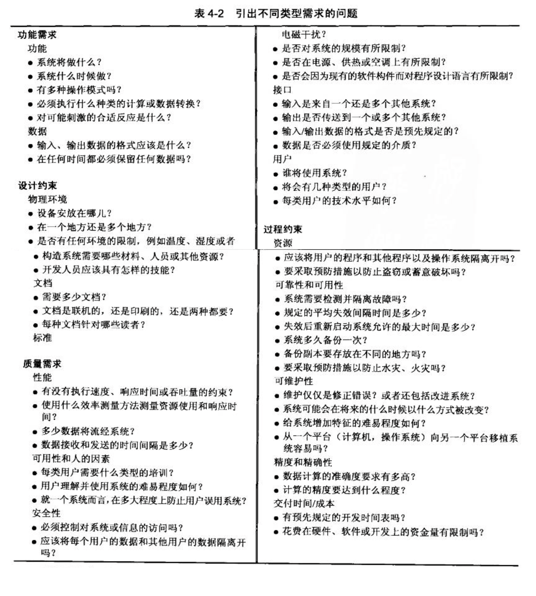
5. 需求文档：
	* 需求定义 客户想要的每一件事情的完整列表
	* 需求规格说明 将需求重新陈述为关于要构建的系统将如何运转的规格说明
6. 需求特性：
	* 正确的
	* 一致的
	* 无二意
	* 完备
	* 可行
	* 相关
	* 可测试
	* 可跟踪
7. 建模表示法：
	* ER图
	* UML类图
	* 时序图
	* 状态机
## 第五章 设计体系结构
1. 体系结构风格：
	* 管道和过滤器 pipe filter  
	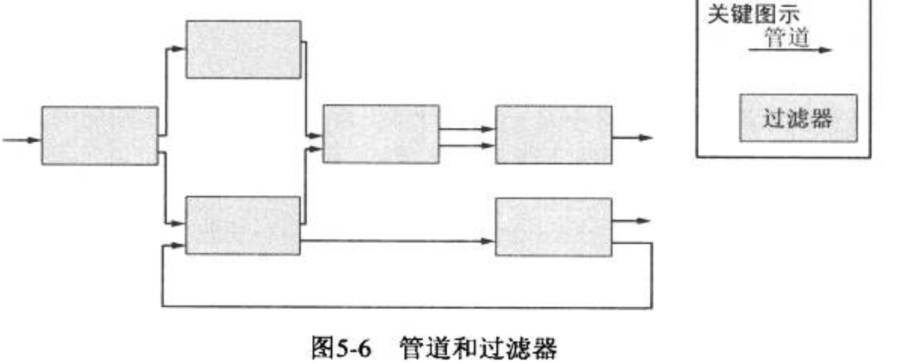
	* 客户－服务器 C/S  
	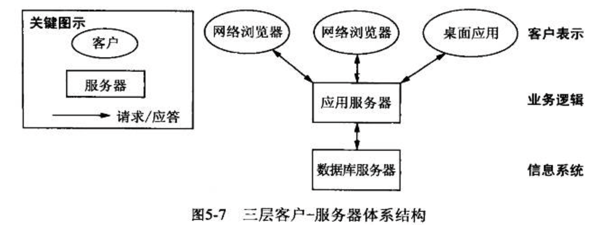
	* 对等网络 P2P
	* 发布－订阅
	* 信息库
	* 黑板  
	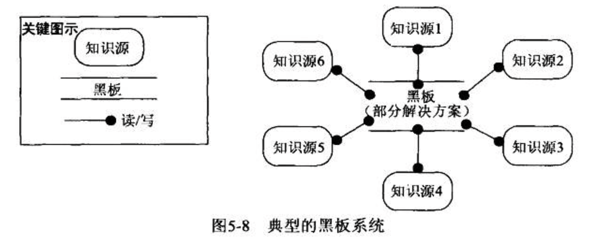
	* 分层系统  
	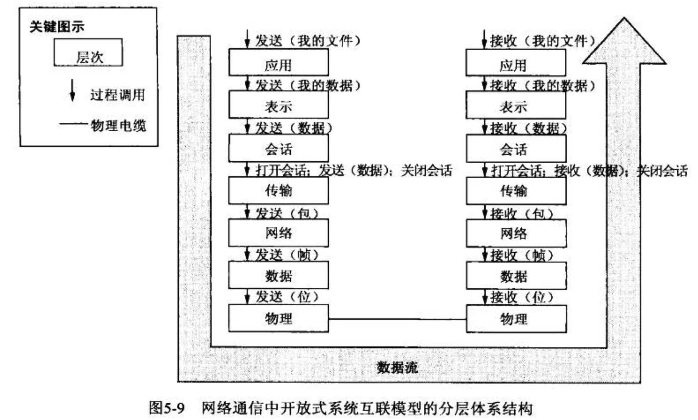
	* 组合体系
2. 满足质量属性：
	* 可修改性
	* 性能
	* 安全性
	* 可靠性
	* 健壮性
	* 易使用性
	* 商业目标
## 第六章 设计模块

1. 设计原则：
	* 模块化
		1. 偶合度 模块之间
			* 紧耦合 两个模块有大量依赖关系
			* 松散耦合 有某种程度的依赖性
			* 非耦合 模块之间没有任何相互连接
			* 内容耦合
			* 公共耦合
			* 标记耦合
			* 控制耦合
			* 数据耦合
		2. 内聚度 模块内部
			* 巧合内聚 模块各个部件互不相关
			* 逻辑内聚 各部分之间通过逻辑结构关联
			* 时态内聚 模块中数据功能仅因在一个任务同时被使用而形成的联系
			* 过程内聚 模块内功能组合在一起只是为了确保这个顺序
			* 通信内聚 将操作或生成同一个数据集的的模块关联起来
			* 功能内聚 只执行某个功能 不执行其他任务
			* 信息内聚 在功能内聚上 将数据抽象化，基于对象
	* 接口 为系统其余部分定义该软件单元提供的服务  
			一个对象的接口是该对象所有公共操作的签名（方法）的集合
			规格说明：
			* 目标
			* 前置条件
			* 协议
			* 后置条件
			* 质量条件
	* 信息隐藏 单元的设计决策被隐藏
	* 增量式开发 
	* 抽象
	* 通用性
2. 面向对象  
	* 对象 一个设计将系统分解成若干个封装了数据和函数的**运行时构件**
	* 属性 对象的数据
	* 方法 对象的操作
	* 子类型
	* 超类型
	* 抽象类
	* 实例变量
	* 动态绑定
	* 对象组合
	* 继承
	* 多态
3.设计模式
	* 模版方法
	* 工厂方法
	* 策略模式
	* 装饰模式
	* 观察者模式
	* 组合模式
	* 访问者模式

##第八章 测试程序
======
1. 故障类型
	* 算法故障
	* 语法故障
	* 计算故障
	* 精度故障
	* 文档故障
	* 压力故障、过载故障
	* 能力故障、边界故障
	* 计时故障、协调故障
	* 吞吐量故障、性能故障
	* 恢复故障
	* 硬件和系统软件故障
	* 标准和过程故障
	* 疏漏型故障
	* 犯错型故障
2. 测试的组织
	* 模块测试
	* 构件测试
	* 单元测试
	* 集成测试
	* 功能测试
	* 性能测试
	* 验收测试
	* 安装测试
	* 系统测试
3. 集成测试
	* 自底向上
	* 自顶向下
	* 一次性测试
	* 三明治测试

##第九章
========

9.1 系统测试原则

**系统测试的目的：确保系统能做客户想要他做的事情**

9.11软件故障根源

仅在特定条件下，软件故障才会引起失效
在开发或维护过程中的任何阶段，都可能存在故障

9.12 系统测试过程

测试系统包括步骤：

1. 功能测试：系统是否按照需求总置顶那样执行功能
2. 性能测试：将集成的构件与非功能系统需求进行比较
3. 验收测试：客户测试系统，确保系统满足用户需求
4. 安装测试：用户能够执行系统功能并记录在实际环境中可能引发的其他问题（目标环境下的运行测试）


回归测试：用于新的版本或发布的一种测试，以验证与旧版本或发布相比，他是否仍然以相同的方式执行相同的任务。
回归测试包含从前面层次的测试中复用最重要的测试用例。

控制版本与发布的方法：

1. delta：存储版本差别
2. 单独文件：不同版本或发布保留单独文件
3. 条件编译：单个代码构件代表所有版本，通过条件语句进行决定那些语句进行编译。

测试小组：
1. 专业测试人员
2. 分析员
3. 系统设计人员
4. 配置管理代表
5. 用户


9.2功能测试
每个功能都可以与完成该功能的系统构件关联起来
系统测试从功能测试开始。
功能测试是基于系统功能性需求的。

9.2.1目的与职责：

线程：与一个功能相关联的动作集合
功能测试：有时称为线程测试

因果图 表示法

减少需要考虑的测试用例的数目，帮助我们预测系统执行的可能的结果，同时，法相某些情形组合造成的无意的副作用。
但是，对于包含时间延迟，迭代，或循环的系统并不实用。


###9.3性能测试
确定系统能执行需求所要求的功能后，开始考虑功能执行的方式。这是针对非功能需求的测试。


####9.3性能测试的类型：

1. 压力测试 ：系统短时间内到达压力极限
2. 容量测试 ：强调处理系统中的大数据
3. 配置测试 
4. 兼容性测试：与其他系统交互时进行，检测接口是否按需求执行
5. 回归测试　：测试系统替代现有系统的时候
6. 安全性测试　：数据，服务的可用性，完整性，机密性
7. 计时测试　：响应时间相关的需求进行测试
8. 环境测试　：考察系统在安装场所的执行能力
9. 质量测试　：评估系统的可靠性，可维护性，可用性
10. 恢复测试：系统对故障的反应
11. 维护测试：
12. 文档测试：核实需要的文档 用户指南、维护指南、技术文档的准确性、易读性、一致性
13. 人为因素测试：


###9.4可靠性 可用性 可维护性
可靠性 可用性 可维护性：性能测试中的最关键的问题，因为并不总能在交付签直接测量。

####定义
可靠性：系统对于给定时间内给定条件下无失效运作的概率
可用性：给定时间上，系统能够按照规格说明正常运作的概率
可维护性：给定使用条件下，规定时间间隔内，使用规定的过程和资源完成维护活动的概率


在需要的时候使用汽车，那么汽车就是可用的，如果起床用了20年，只进行过两次维护，就称为高可靠性的。汽车出故障，当时厂商停止配件生产，需要在修理店修理很长时间，称可维护性很差

第一类不确定性：不能预测哪个故障将触发下一个失效。
第二类不确定性：不能确定我们改正子啊多大程度上增加了软件可靠性

####9.4.3测量可靠性 可用性 可维护性
平均无故障时间MTTF：失效间隔时间或失效发生时间的平均值
平均修复时间MTTR：修复一个有故障的软件构件需要花费的平均时间
平均失效间隔时间MTBF：MTTF+MTTR

可靠性：MTTF/（1+MTTF）
可用性：MTBF/(1+MTBF)
可维护性：1/(1+MTTR)

可靠性稳定性：失效间隔时间保持不变
可靠性增长：失效间隔时间增加

f(t):[t1,t2]中失效的可能性
F(t):分布函数是时间t之前的失效概率
可靠函数：=1-F(t)


对任何系统的预测三要素：

1. 预测模型 ：概率规格说明及连续时间的独立性假设
2. 推理过程 ：根据已有数据的值推理模型的位置参数
3. 预测过程 ：将模型与推理过程结合，以预测将来的失效行为

操作特征图：描述随着时间推移用户可能的输入

统计测试策略：基于操作特征图的随机输入


###9.5验收测试

询问客户和用户，他们是否对系统满意

验收测试的种类：

1. 基准测试  用户准备测试用例进行测试评估
2. 实验性测试 在试验的环境中安装系统（α测试 β测试）
3. 并行测试  新系统与先前版本并行运转

###安装测试

在用户的场所安装系统

###9.8测试文档

测试文档需要：

1. 测试计划  ：陈述测试目标-解释需求文档、设计文档、代码构件、代码文档、测试过程的关系-系统概要-描述使用的主要测试和测试方法-测试进度
2. 测试规格说明与评估 ：明确测试条件 原理 方法
3. 测试描述 ：执行测试的指南 需包括：控制手段 数据 过程
4. 测试分析报告 ：对测试结果进行分析报告

9.8.5问题报告表：比较故障和失效的相关数据
差异报告表：描述实际系统的行为和属性与我们预期的不相符的情况的问题报告
故障报告表：故障是如何发现和修复的


###9.9测试安全攸关的系统

极端高可靠性 系统在10^9小时内最多出现一次失效

确保可靠性方法：

1. 设计多样性
2. 软件安全性案例
3. 净室方法


## 第十章
========
#交付系统
##培训
###种类

1. 用户培训
2. 操作员培训
3. 特殊培训需求：超出了系统培训需求的培训

###培训助手
1. 文档
2. 图元和联机帮助：图元即图形元素

##文档
###文档种类
1. 考虑读者
2. 用户手册：针对系统用户编写的参考指南或者教程（系统目标目的；功能或能力；特征优点工作流程）
3. 操作员手册
4. 系统概况指南
5. 教学软件和自动化系统的概念
6. 其他的系统文档

###用户帮助和疑难解答
1. 失效消息参考指南
2. 联机帮助
3. 快速参考指南

---
---
#维护系统
##变化的系统
只要当系统开发完成之后，任何针对系统改变所做的工作都是维护
###系统类型
1. S系统：针对一个给定的矩阵集，在满足某种性能约束的情况下，执行矩阵的加、乘、逆运算，开发人员不用考虑解决方案正确性，只需要关心如何正确的实现解决方案
2. P系统：对于可能出现很多种解决方案的情况，无法短时间计算出所有的结果，所以对于问题需要抽象进行改变
3. E系统：考虑现实世界情况是变化的，该系统是世界的一个组成部分

###在系统的生命周期过程中发生的变化
变化表格11-1

最初的改变活动  |  需要随之改变的制品
--------------- | ---------------
需求分析|需求规格说明书
系统设计|体系结构设计规格说明
		|程序设计规格说明
程序设计|程序设计规格说明
程序实现|程序代码
	|程序文档
单元测试|测试计划
		|测试脚本
系统测试	|测试计划
		|测试脚本
系统支付	|用户文档
		|培训助手
		|操作员文档
		|系统指南
		|程序员指南
		|培训课
###系统生命周期跨度
1. 开发时间与维护时间
2. 系统演化与系统退化
3. 软件演化法则

##维护本质
###维护活动角色

1. 改正性维护：对故障导致的问题立即作出反应，进行处理
2. 适应性维护：对系统的一部分的改变会要求改系统的其他部分
3. 完善行维护：为了对系统的某些方面进行改进二做出的改变
4. 预防性维护：改变系统的某些方面，从而预防失效的发生
5. 谁进行维护
6. 小组责任
7. 维护时间的使用

##维护问题
###人员问题
1. 有限的理解能力
2. 管理的优先级
3. 士气

###技术问题
1. 制品和范型
2. 测试的困难型

###必要的妥协
###维护成本
1. 影响工作的因素：应用类型；系统新颖度；人员替换和维护人员的可用性；系统生命周期跨度；对变化的环境的依赖性；硬件支持；设计质量；文档质量；测试质量
2. 建模维护工作量：M=p+K^(c-d) p总体生产工作量；c由于缺乏结构化的设计和文档引起的复杂性；d维护小组对产品的熟悉程度；K为经验常量，依赖于环境


##测量维护特性
从两个方面讨论：反映软件内部的视图和反应软件外部的视图

##维护技术和工具
1. 配置管理
2. 影响分析：部署之后维护才算开始，影响分析是对与变化相关的多项风险进行的评估
3. 自动维护工具：文本编辑器，比较器；编译器，链接器；调试工具；交叉引用生成器；代码分析器；配置管理库

##软件再生
通过设法提高现有系统的总体质量来应对维护挑战

##文档重构
对源代码进行静态分析以产生系统文档

-----
-----
#产品评估，过程评估和资源评估
##评估方法
一项评估技术包含一下四种中的一类

1. 特征分析
2. 调查
3. 案例研究
4. 正式实验

###特征分析
用来对各种产品的属性进行评测和排列，以便知道应该购买哪种工具或者使用哪种方法
###调查
一种回顾性的研究，它设法证明了某种给定情况下的关系以及结果，常常用于社会科学。进行调查时我们不能控制当前情形，只能记录某种情形的信息，将其与相似情形进行比较，但是无法操作可变因素
###案例研究
非回顾性研究，前提是决定研究的内容，然后计划如何获取数据支持研究。在此过程中确定可能影响活动结果的因素，随后记录：输入、约束、资源、输出。

案例研究通常将一种情形和另外一种进行比较，常用组织研究的方法：

1. 姐妹项目：进行研究的两个项目之间相似度很高，对一个项目使用当前方法研究，对另一个使用心得方法，从而根据控制结果中的差别找到审查技术的差别
2. 基线：在不能找到相似的项目时可以使用，不考虑项目的不同，通过计算数据的集中趋势和分散趋势对平均情况进行了解
3. 随即选择：把单个项目分为若干个部分，一个部分用新的技术其他部分不用

###正式实验
通过操作自变量的值来观察因变量的变化从而确定输入是如何影响输出的
###准备评估
评估进行的第一步是准备评估的阶段，关键步骤如下

1. 假设的设置：明确指出想知道什么，这是试验的理论推测（为保证假设的可证实性，常用量化的术语描述假设）
2. 保持对变量的控制
3. 使研究有意义：考虑到控制的限制以及无法控制的情况

##选择评估技术
###关键选择因素
选择评估技术时需要考虑很多因素：可控性高的采取正式实验，否则考虑案例研究；可实践性也是同样重要的因素，实践性高的可以使用正式实验；研究情形的复用性也能影响，复用性越高，就越能支持正式实验(感觉正式实验是最严谨的一项评估方法，我们一般进行评估时最先考虑正式实验)
###相信什么
对于研究结果有冲突的情况下，我们需要知道相信哪一项研究。在研究中，每种类型的实证性研究都在起部分作用，研究类型和数量取决于时间、成本、实用性和必要性（这个感觉不会考）
##评价与预测
测量：从真实的经验世界中的一组实体和属性到数学表示或模型的映射，对于软件的测量确认需要了解两种系统：

1. 测量系统：用来评价现有实体，通过数值形式刻画一个或多个属性
2. 预测系统：用来预测实体将来某些属性，包括与预测过程相关的一个数学模型

###确认预测系统
对于给定模型，需要考虑**确认预测系统**(给定输入得到同样输出)和**随即预测系统**(输出结果有一定概率变化)
###确认测量
**表示条件**：测量数值间的关系，或者是属性之间的关系。eg m为程序长度(表示测量)，当P1比P2长时，一定有m(P1)>m(p2)
##评估产品
###产品质量模型(不知道要不要掌握)

1. Boehm
2. ISO 9126
3. Dromey

###建立基线设定目标
基线是以某种可测量的方式描述一个或一类组织机构中一般的或典型的结果

目标是指设定为定义的最小的可接受的行为方式
###软件可复用性
####复用类型

1. 复用者角度：生产者（创建），消费者（使用）
2. 使用者是否修改：黑盒（不用进行修改），透明盒（需要修改）
3. 方法：组合式复用（代码看成构造块），存放在复用库中
4. 具体应用领域：生成式复用，为满足具体应用需求而设计的
5. 垂直复用：同一领域
6. 水平复用：跨领域

####复用技术构建检索
为解决大量软件产品中挑选复用对象，解决方案是**构件分类**，可以按照层次方案对构件进行分类
##评估过程
1. 事后分析：对项目的所有方面，在实现之后进行评价
2. 过程成熟度模型：

		1.能力成熟度模型，5个阶段（图12-9）
		2.SPICE
		3.ISO 9000
		
##评估资源
###人员成熟度
五个等级：初始级，可复用级，定义级，管理级，优化级
###投资回报
现值，贴现率，机会成本，净现值（基本概念没给出）



